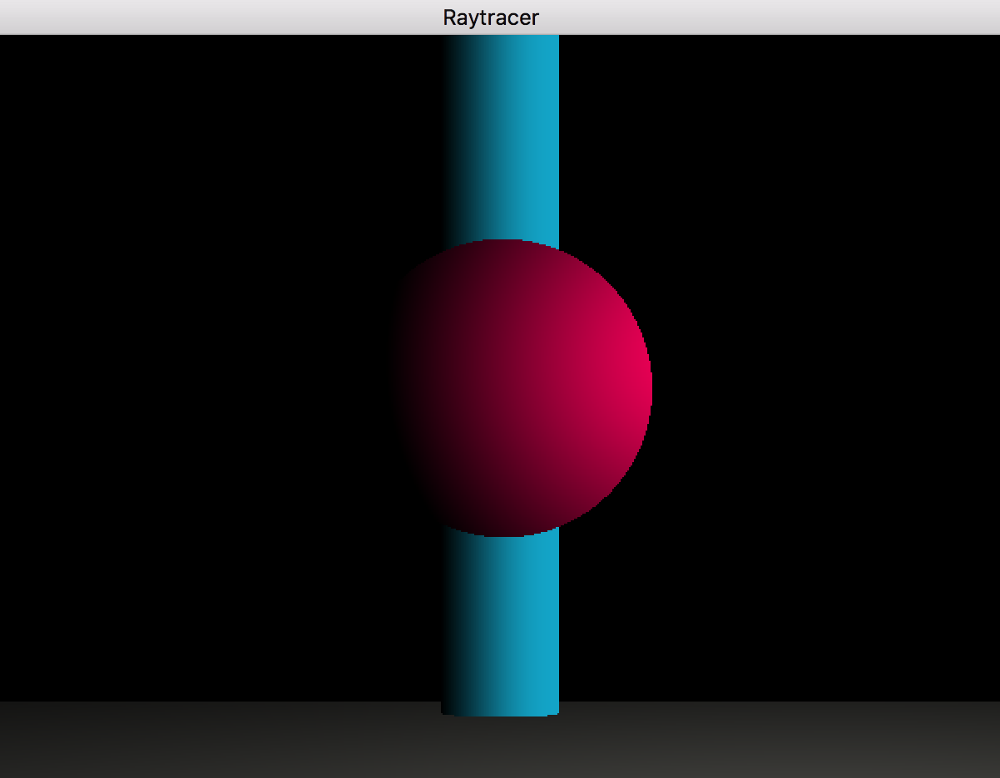

# Raytracer

Raytracer is an Epitech project using ray tracing techniques, with an epitech library, the minilibX.  
Made in 2014.

## Installation of the minilibX

This project requires the installation of the minilibX to be able to work.  
Follow this link to install and custom the makefile to your OS. (French Only)  
https://achedeuzot.me/2014/12/20/installer-la-minilibx/
